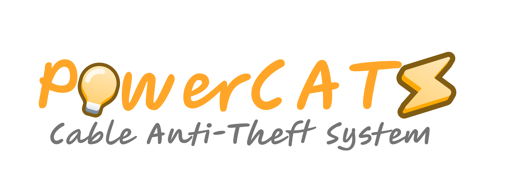

  

<h1 align="center">  </h1>
 
 
 

Sistema Antifurto de Cabos de Energia em Caixas de Passagem usando tecnologia IoT. Web Service to register sensors, sensors measurements and sensors alerts.  
 
 
<a href="https://www.ifsc.edu.br/web/campus-florianopolis">Projeto financiado pelo IFSC - Florianópolis</a>

<!---
PowerCATSproject/PowerCATSproject is a ✨ special ✨ repository because its `README.md` (this file) appears on your GitHub profile.
You can click the Preview link to take a look at your changes.
--->
